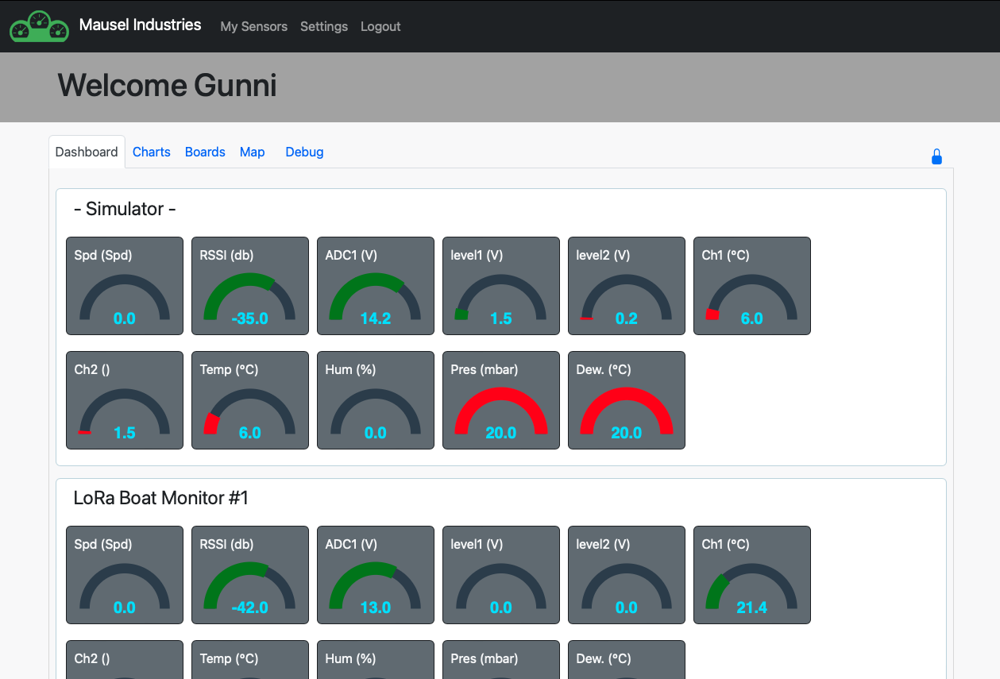
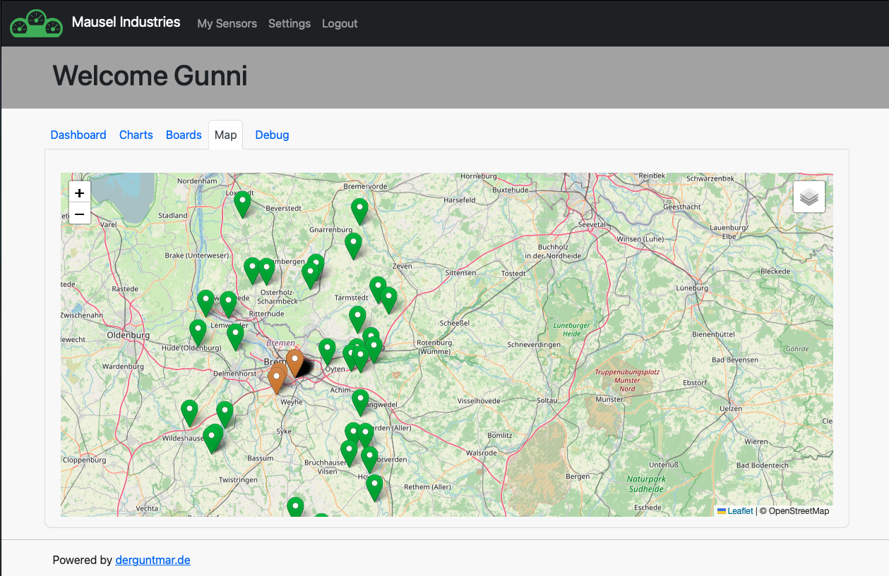

# Intro
**Maritime Data Server** is the central data (cloud) server for maritime data. 
It stores data that come from (IOT) devices, for example **MDC** (Maritime Data Collector or LoRa-Bootsmonitor or any other supported device), into a database and gives the user a GUI to show the data and do some configurations.
Also it is possible to receive notifications about configured sensor data.

The initial idea was, to be able to see how healthy my boat is.
This means for example see some temperatures, battery voltages, bilge alarms... while i am not on the boat.

The **MDC** it a small board with an ESP32 and a few sensors, that collects the sensor data and transfer these data to the MDS.
You will find the **MDC** documentation under **https://github.com/bytecrusher/MaritimeDataCollectorSmall**

## **MDS** (Maritime Data Server)

The **Maritime Data Server** is a web application that stores data and display it to the user.
It requires a MySQL database for storing the data and a web server with PHP support. To display the data some HTML, CSS and JS is used.
The **MDS** can display the data (that come from sensors) in graph/gauges or charts.
Also it is possible to configure boards and sensors, or add new boards to a user account.

## Description
The server is organized in a
     - backend (API for receiving data from MDC (collector) and TTN, send emails) and a
     - frontend for displaying data in the users browser.  
The backend stores the data into the DB. It also checks if Data are valid and boards and sensors are existing in the DB, otherwise new DB records will be create.  
For the frontend the user needs to login. Now the user is able to do some configurations or display some data.

#### Functions / ToDos Status / Bugs
- [x] Change static email addresses (sender) into variables. These will be defined in the install script.
- [ ] 

## Folder description

- **docu_donotdeploy** folder contains data and images for documentation.
- **src**
     - **frontend** the frontend files for this web project
          - **api** api files for requests from JS.
          - **common** common files like "header" and "footer".
          - **css** stylesheets
          - **func** php functions for internal use (DB connection, users, boards...).
          - **img** images for pages, i.e. board images.
          - **js** javascript files.
          - **register** Files for new user registering.
     - **install** scripts to install and prepare sql DB, create the tables and the admin user.
     - **logs** log files for debugging.
     - **node_modules** (maybe not exist right now, because it will be created after running npm)
     - **otafirmware** contains OTA files for update ESP.
     - **receiver** functions for receiving Data from MDCs.

#### Installation
Copy all **MDS** files contained in the "src" folder to your htdocs dir.
Create a new database (for example with phpmyadmin) and create a new user with write privileges to this database.
Open **http://yourdomain/** in your browser and step through the installation steps.
Enter all necessary informations and fill out the text boxes.
After install is finished, remove the dir named "install" (for security reasons).

Now the **MDS** is available under **http://yourdomain/**

#### MDS Requirements
For running the **MDS** you need a web server (in my case Apache) with PHP (at least version 8.0) support and a MySQL DB.  
If you run **MDC**s outside our local network, your **MDS** needs to be public (TTN should be able to reach your server).

###### Development
For development i use two different solutions.
First is local Docker container that runs on my coding computer.
Second i have on my web hosting a subdomain, that pulls my "development" branch from github direct over there.

######## My current way
First solution:
I setup 4 containers (one for each service):
- Apache
- PHP
- PHPmyAdmin
- MySQL

I configured my VSC to be able to work direct in the htdocs folder of the apache container.
So there is no manual synch of files needed, after i made some changes in the code.

Second solution:
In my web hosting subdomain, i setup my repository under dev tools, so i am able to run a pull request from the plesk panel and have the latest development branch on the web space.
This makes it very easy to deploy me new branch to my subdomain an test it this environment.

###### Debugging with xDebug
for php debugging i use xdebug.
The configuration in MAMP is done in **/Applications/XAMPP/xamppfiles/etc/php.ini and looks:  
[xdebug]  
zend_extension="/usr/local/Cellar/php/8.1.1/pecl/20210902/xdebug.so"  
xdebug.mode=debug  
xdebug.client_host=127.0.0.1  
xdebug.client_port="9000"  

In Firefox i use the "Xdebug helper" (IDE Key: VSCODE).  
In Safari i use "XDebugToggleExtension 1.2".

For Debug you have to go to "Ausführen" - "Debugger starte" and the green play button (F5).

## Sensor Schemas
Due different types of sensors and try to reduce the amount of Data transferred via wifi (and later lora) it is a good idea to have a schema for sensors to transfer the Data.
Also there is no need to deliver the name of the value.  
If all values deliver in the correct order, it is clear which value is which.

Schema #: 1  
Name: DS18b20  
Description: Tempsensor  
Nr of sensor (that are connected): 1  
Count of Values: 1  
Name of Values: #1 Temperature  
Type of value: #1 uint8 (?)  

Schema #: 2  
Name: DS2438  
Description: Batteriemonitor  
Nr of sensor (that are connected): 1  
Count of Values: 4  
Name of Values: #1 CH1 Voltage, 2# CH1 Current, #3 CH2 voltage, #4 CH2 current  
Type of value: #1 uint8 (?), #2 uint8 (?), #3 uint8 (?), #4 uint8 (?)  

Schema #: 3  
Name: DHT11  
Description: Tempsensor & Humidity  
Nr of sensor (that are connected): 1  
Count of Values: 2  
Name of Values: #1 Temperature, #2 Humidity  
Type of value: #1 uint8 (?), #2 uint8 (?)  

Schema #: 4  
Name: Digital Input  
Description: Digital Input  
Nr of sensor (that are connected): 1  
Count of Values: 1  
Name of Values: #1 Digital input  
Type of value: #1 Bool (?)  

Schema #: 5  
Name: GPS  
Description: Data from GPS Receiver  
Nr of sensor (that are connected): 1  
Count of Values: 4  
Name of Values: #1 Latitude, #2 Longitude, #3 Course, #4 Speed  
Type of value: #1 uint8 (?), #2 uint8 (?), #3 uint8 (?), #4 uint8 (?)  
